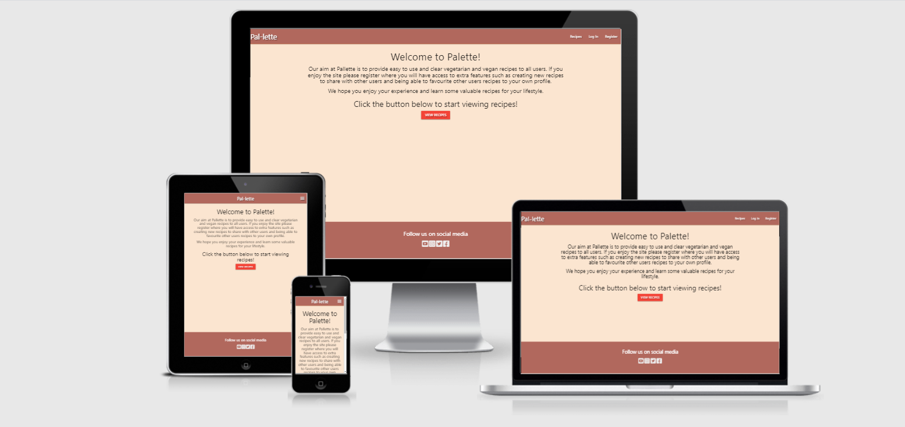
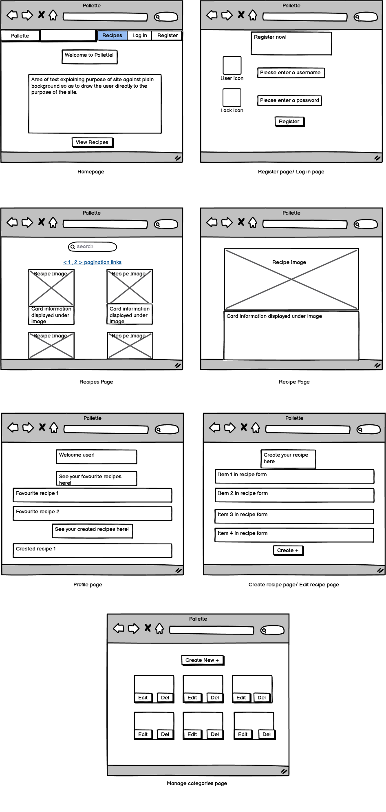
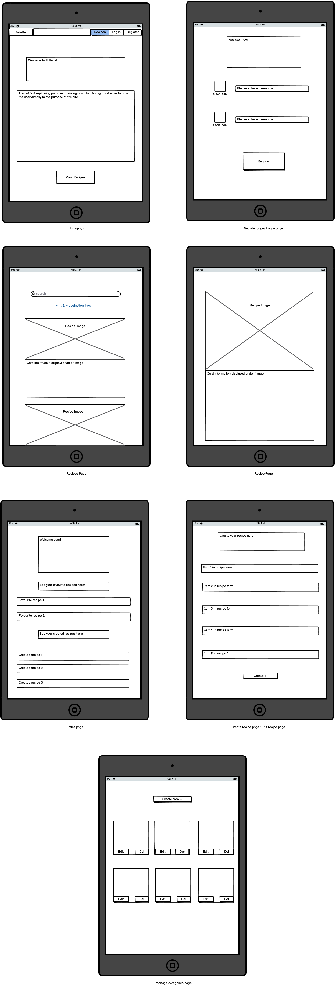
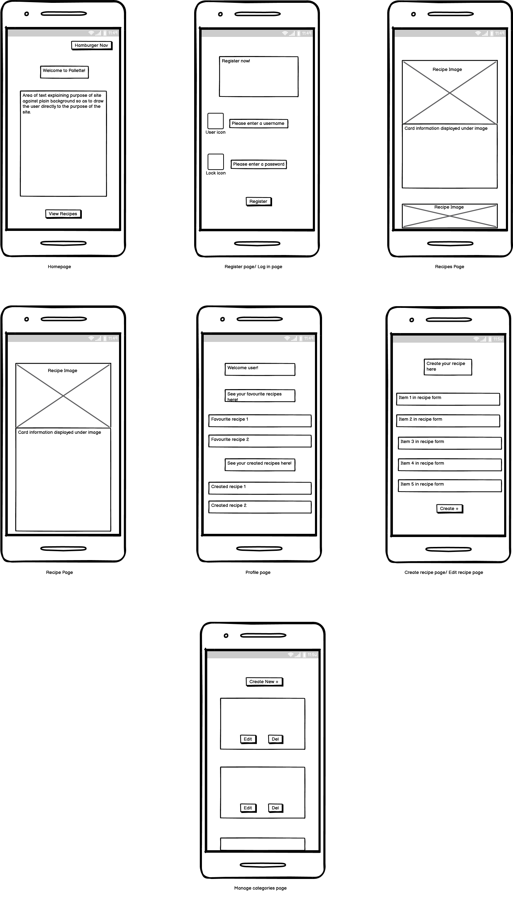
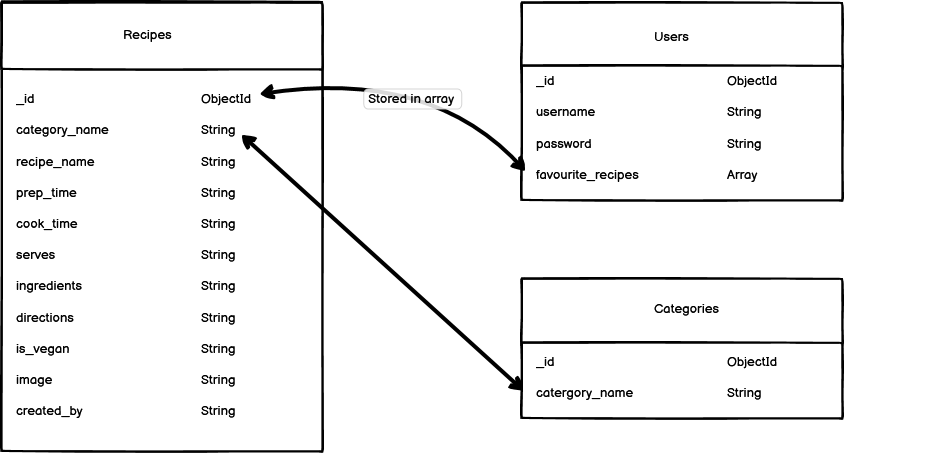

# Pal-lette

### Live Site = [Pal-lette](https://pal-lette.herokuapp.com/)

### Vegetarian/Vegan Recipe Helper 

A website designed to provide user's with a choice of vegatarian and vegan recipes in an easy to use format.
It features a welcome message on the **Homepage** to allow users to understand the purpose of the site as it is a very targeted recipe site.
The idea was to create an easy to use and interactive recipe site where the user can browse for various vegetarian and vegan options and also have the choice using **CRUD** functionality to create,read,update and delete their own recipes and provide extra functionality in the form of favouriting others recipes.
It also feature **search** functionality and **pagination** to aid the user when it gets to a point where there are alot of recipes, it rids the need to do endless scrolling as only a certain amount in this case 4 recipes will show per page but can easily be updated to display more.

#### Business Goals
  - To increase traffic to the site and in turn increase registration.
  - To provide simple easy sign up process to enable users to register.
  - To provide simple yet comprehensive information on recipes in the vegetarian/vegan area.
  - To be visually striking enough to catch attention and provoke curiosity to explore the page.
  - To potentially encourage advertisers to place their ads on the page for untensils and other cooking items thus opening up more opportunities for more recipes, engagement, special offers and expansion of the site.
  - To build awareness of the brand.
  - Get users to choose a recipe guide and to be able to engage by uploading their own thus making it a creative and user driven platform.

#### Customer Goals
  - To find the best recipe for their needs.
  - To be able to find any information they may need.
  - To see benefits to signing up for such a site.
  - To be able to create their own recipe.
  - To be able to read existing recipes added by anybody.
  - To be able to update existing recipes added by themselves.
  - To be able to delete existing recipes added by themselves.

# UX

 #### Potential Customers
  - Any vegetarian or vegans that may find it difficult to find a specifically diet based site to find recipes.
  - People interested in trying a new diet or lifestyle.
  - As this diet type is on the rise due to publicity in such documentaries as the gamechangers and other on netflix and other sources, customers may also be people who are just curious about how practical the diet may or may not be.
  - Any user who may just stumble across the page in an attempt to find recipes online.

#### This website will provide value with
  - An easy sign up process.
  - A simple format to navigate for older and younger users alike.
  - Accurate information.
  - A good UX so as to encourage visitors to register and upload their own recipes and to leave feedback on others recipes.
  - Details of convenient information on each recipes so as to make the process as easy as possible to translate into real world cooking.

#### User Stories

 1. As a new user I want to know the sites purpose immediately.
 2. As a new user I want an intuitive search experience.
 3. As a new user I expect to be able to navigate the site easily to find a recipe.
 4. As a new user I expect to be able to sign up to services.
 5. As a potential customer I want an easy sign up process.
 6. As a potential customer I want an easily explained process for the recipes.
 7. As a potential customer I want to have a good choice as well as leave feedback on recipes.
 8. As a returning user I want information and other useful content to entice me to return.
 9. As a returning user I want to be able to create, read, update and delete my own recipes.
 10. As a returning user I want to be able to have access to follow the company on social media.
 11. As a user I expect to be able to login and out of my own profile.
 12. As a site admin I expect to be able to create, read, update and delete any information on the site.

# Design

## Colour Scheme

The site features a few choice colors being :
-  **Paint-Chip** (#fbe5d0),
-  **Electric-Brown** (#b1685d),
-  **Green** similar to **Olive** (#519839),
-  **Medium Carmine** (#b04632),
-  **Off White** (#e1eedd),

These colours were chosen to give a **Spacious** feel to the website but not have it so empty that it was not a user friendly environment.
Also some of the colors were used to give a healthy earthy feel to the site through the mixture of green and brown mixed with creamy colours. The lack of images on the home page was used to direct the users attention to the text explaining the purpose of the site which is focused on functionality and not on display though the display aspect is addressed once the user navigates to the **recipes** page and onwards throught he use of cards with images displaying the recipes themselves.

## Fonts

- The site mainly uses the default font type of **"sans-serif"** for all pages to provide easy reading for all ages and so as to not overload the user with different font types which can make the information appear less clean and manageable. I considered adding a different font as I have in other projects to identify key information but as the site is fairly spacious I did not feel the need to highlight many areas as the information in my opinion is spaced out and laid out well enough to be readable as is.

## Imagery

The images used are all **recipe related**. I thought it was important to have a consistant theme of visually striking recipe images,
that were all close enough in subject matter and color to make a consistent feel across the site.The color of the images was important to have good contrast with the site **color scheme** since there is only a small amount of images present and 
I believe the images chosen fit very well overall as they relate to the subject matter of cooking but also provide good impact both visually in arrangement and colour wise with such a plain background through the rest of the site.

### Wireframes

#### **Desktop** 

#### **Tablet** 

#### **Mobile** 

#### **Database Design**

# Features

### Common features on all pages 

#### All site visitors

The site features a responsive navigation bar stuck **on top** for easy navigation to the different pages which also collapses to a **mobile side-nav** when the screen size is reduced to a certain point which contains all the same links as the full size navbar.The logo on the **top left** will provide a one click link to the **Home** page these features are included on every page.The navigation bar is also linked to the other pages **Recipes**,**Login**, and **Register** to allow easy access to any page the **Non registered** user may require.
The site also has a footer containing social media links to **Facebook**, **Instagram**, **Twitter**, **Youtube**.
The **fonts** and **colors** were also continued page to page where applicable
to give uniformity to the appearance and provide a consistent experience.The site logo **Pallette** when clicked will also redirect the user back to the **homepage**.

#### Logged in Users

The site features a responsive navigation bar stuck **on top** for easy navigation to the different pages which also collapses to a **mobile side-nav** when the screen size is reduced to a certain point which contains all the same links as the full size navbar.The logo on the **top left** will provide a one click link to the **Home** page these features are included on every page.The navigation bar is also linked to the other pages **Recipes**,**Profile**,**New Recipe**, and **Logout** to allow easy access to any page the **Logged in/Registered** user may require.
The site also has a footer containing social media links to **Facebook**, **Instagram**, **Twitter**, **Youtube**.
The **fonts** and **colors** were also continued page to page where applicable
to give uniformity to the appearance and provide a consistent experience.

#### Site Admin

The site features a responsive navigation bar stuck **on top** for easy navigation to the different pages which also collapses to a **mobile side-nav** when the screen size is reduced to a certain point which contains all the same links as the full size navbar.The logo on the **top left** will provide a one click link to the **Home** page these features are included on every page.The navigation bar is also linked to the other pages **Recipes**,**Profile**,**New Recipe**,**Manage Categories**, and **Logout** to allow easy access to any page the **Site Admin** may require.
The site also has a footer containing social media links to **Facebook**, **Instagram**, **Twitter**, **Youtube**.
The **fonts** and **colors** were also continued page to page where applicable
to give uniformity to the appearance and provide a consistent experience.

### Other Existing Features 

#### All users 

-General vistors do not have access to all pages and thus only have a limited amount of optiuon therefore encouraging registration.Upon resizing the pages for all users less and less information is displayed on the cards until just a card, image, and view recipe button is displayed on the smallest screens to not make the cards to busy and keep it simple.

##### Home Page 

- Has a greeting to the user with a **view recipes** button located below it,this redirects the user to the **recipes** page.

##### Recipes Page

- Has a **paginated** view of all the current recipes with a **view recipe** button located on each that redirects the user to the individual **Recipe** page.
- Each card displays a **recipe image** as well as information such as **Recipe name**, **Vegan friendly**, **Prep-time**, **Cook-time** and how many people the recipe is intended to serve with corresponding **icons** located beside each for good visual contrast with the plain card background.
- It also contains a **search** field to allow the user to search for words that may be included in the **ingredients**, **directions** or **recipe name** this will only show results that contain the searched term.
- A **Reset** button is located beside it to allow the user to rest the search field and begin again.

##### Individual Recipe Page

- Has a page sized card that displays a **recipe image** as well as information such as **Recipe name**, **Vegan friendly**, **Ingredients**, **Directions** and how many people the recipe is intended to serve with corresponding **icons** located beside each for good visual contrast with the plain card background.

##### Register Page

- Contains a 2 step **form** for registration which requires a **username** that is not already picked and a **password** which will be **hashed** in order to sign up to the site.
- It also contains a **submit** button to complete the registration, and a **Log in** button for users who may want to log in to their profile but perhaps clicked the **register** link by accident.
- Displays a **flash** message indicating whether registration was susccessful or not.

##### Log in Page

- Contains a 2 step **form** for Log in which requires a **username** that is registered and the **password** associated with that username to log in.
- It also contains a **log in** button to complete the login process, and a **register** button for users who may want to register a profile but perhaps clicked the **log in** link by accident.
- Displays a **flash** message indicating whether login was susccessful or not.

#### Registered/Logged in users

Logged in users will have access to all of the above features with the exceptions of the **Log in** and **Register** pages as these are replaced by a **new recipes** page, a **new recipes**, a **profile** page and a **logout** link. In addition I have listed additional items located on the accessible pages that are available to logged in users but not general site visitors.

##### Home Page 

- Has a greeting to the user with a **view recipes** button located below it,this redirects the user to the **recipes** page.
- Has an updated navbar with as discussed above links for **recipes**, **profile**, **new recipes** and **logout**.

##### Recipes Page

- Has a **paginated** view of all the current recipes with a **view recipe** button located on each that redirects the user to the individual **Recipe** page.
- Each card displays a **recipe image** as well as information such as **Recipe name**, **Vegan friendly**, **Prep-time**, **Cook-time** and how many people the recipe is intended to serve with corresponding **icons** located beside each for good visual contrast with the plain card background.
- It also contains a **search** field to allow the user to search for words that may be included in the **ingredients**, **directions** or **recipe name** this will only show results that contain the searched term.
- A **Reset** button is located beside it to allow the user to rest the search field and begin again.
- Contains add to and remove from **favourites** on each card in the form of styled anchor links which are only displayed once a user is logged in. Add is displayed as a **plus** and remove as a **minus** icon and **colored** differently so as to make it obvious to the user as to which button corresponds to which action.This will also display a **flash** message to the user indication successful removal or addition of said recipe from favourites.

##### Individual Recipe Page

- Has a page sized card that displays a **recipe image** as well as information such as **Recipe name**, **Vegan friendly**, **Ingredients**, **Directions** and how many people the recipe is intended to serve with corresponding **icons** located beside each for good visual contrast with the plain card background.
- Contains add to and remove from **favourites** on each card in the form of styled anchor links which are only displayed once a user is logged in. Add is displayed as a **plus** and remove as a **minus** icon and **colored** differently so as to make it obvious to the user as to which button corresponds to which action.This will also display a **flash** message to the user indication successful removal or addition of said recipe from favourites.

##### Profile Page

- Contains a greeting with the **username** of the user displayed.
- Contains a heading for **favourite recipes** displayed regardless of if the user has favourited any or not so as to show the user upon login that the favourite functionailty exists now that they have a profile.Under this heading is where any favourited recipes names will be displayed so the user can quickly find them.
- Contains a heading for **created recipes** displayed regardless of if the user has created any or not so as to show the user upon login that the create functionailty exists now that they have a profile.Under this heading is where any created recipes names will be displayed so the user can quickly find them. This section also has **colored** **edit** and **deleted** buttons that will allow the user to edit or delete recipes belonging to them alone.

##### New recipe Page

- Contains a 8 step **form** to create a new recipe. A dropdown with categories appears first to allow the user to select a category for their recipe.
- It also contains a form field with **icons** for each of the required pieces of the recipe to create consistency across the site for all recipes.
- It contains an input to allow the user to upload an **image** url for their recipe.
- It contains a switch to allow the user to select whether the recipe is deemed **vegan** or not which depending on the users choice will show the green **Vegan** icon and text or the red **not vegan** icon and text.
- It contains a **create** button which will create the recipe once the required form fields have been filled out.

##### Edit recipe Page

- Contains all the features from the above **New recipe** page with the exception that all the fields are **prepopulated** with the users data from their own original recipe.
- This will also display a **flash** message to the user indicating successful editing of said recipe.

#### Admin

The Admin of the site has access to all above features plus the additonal **navbar** link to **manage categories** which includes adding,editing and deleting said categories which is not available to any other users.This page contains quick link **cards** to each category for easy data manipulation.
On top of this the admin also has the ability to create,edit and remove all recipes from all users thought the addition of extra buttons (displayed only to the admin) located on the bottom of the cards on the recipes page.

### Features Left to Implement

- **Terms and conditions** page to allow users to read through the legal documentation associated with the site.Too much time involved reviewing legal documentation to implement straight away.
- Option to change **languages** to some other than English.Too expensive to hire someone to check translations on current budget.
- Using **cloudinary** or similar for upload of images instead of image urls.Time constraints did not allow for implementation.
- **Filter** option so users have even more choice on how to view recipes on the main recipes page such as being able to choose- vegan + with butter + less than 15mins.Time constraints did not allow for implementation.
- More Details in recipes such as **allergen information** and **cost** to purchase ingredients.
- Country or cuisine style filters to allow users to search for a recipe based on its style such as **Italian**, **Indian** etc.Time constraints did not allow for implementation.

# Technologies Used

- **[HTML5](https://en.wikipedia.org/wiki/HTML5)** - To write core content contained on site.
- **[CSS3](https://en.wikipedia.org/wiki/CSS)** - To style core content displayed on site.
- **[Python3](https://www.python.org/)** - To write core backend logic for the site such as routes for anchor links and defensive features used in tandem with Flask and MongoDB to build an interactive database for the site.
- **[Flask](https://flask.palletsprojects.com/en/2.0.x/#)** - Used as the web microframework for the site.
- **[MongoDB](https://www.mongodb.com/)** - Used as the database for the site.
- **[Jinja](https://jinja.palletsprojects.com/en/3.0.x/)** - Used as the templating language.
- **[MaterializeCSS](https://materializecss.com/)** - Used to help style and provide grids for layout of the site. Also used to design the site with mobile first mindset and implement features for responsiveness such as the navigation bar more easily.Materialize version 1.0.0 was used.
- **[jQuery](https://jquery.com/)** - Used to reference Javascript used for navbar and validation on the forms.
- **[FontAwesome](https://fontawesome.com/)** - Used as a link and source for icons displayed on site.
- **[Gitpod](https://www.gitpod.io/)** - Used as the interactive development environment (IDE) for the project.
- **[GitHub](https://github.com/)** - Used to display and share all files related to the project.
- **[Balsamiq](https://balsamiq.com/wireframes/?gclid=CjwKCAiA8Jf-BRB-EiwAWDtEGkJ6iKra1Rpbr_P_NWTlH_xSyg5fnl9cG87m1uVtg1HJKb3bCsG0BhoC3yMQAvD_BwE)** - Used to create wireframes for the site.
- **[Placeholder](https://placeholder.com/)** - Used to add colors to Readme.
- **[GameChangersMovie](https://gamechangersmovie.com/)** - Used to source images and recipe content for the site.
- **[Favicon.io](https://favicon.io/)** - Used to add Favicon to site.

# [Testing](TESTING.md)

# Deployment 

- In order to deploy this project as I have the following is required [Python3](https://www.python.org/),  [Github account](https://github.com/),  [MongoDB account](https://www.mongodb.com/),  [Heroku account](https://www.heroku.com/).

After you have succesfully signed up for these and installed the requirements proceed as below.

#### Step 1 Clone the project 

To make a local clone, follow these steps. 
1. Log in to GitHub and go to the repository to wish to clone. 
2. Click on the green button that reads **Code**.
3. Click on **“Open with GitHub Desktop”** and follow the prompts.

#### Step 2 Use the local copy
1. Install all the requirements: Go to the workspace of your local copy. 
2. In the terminal type: **pip3 install -r requirements.txt** and hit enter, this will create
a file which python will need to run correctly as it contains a list of required dependancies.
3. Create your database in MongoDB using the following steps: 
    - **Login** to your account.
    - Create a **cluster** and a **database** within that cluster.
    - Create 3 collections in the database mine were named: **categories, recipes,** and **users.**
    - Add string values for the collections.(Mine were all string values with the exception of **favourite_recipes** in **users collection** which is an **array** for each user)
4. Create the environment variables 
    - Create a .gitignore file in the root directory of the project if it does not already contain one, this will be used to ignore and not share your environment variables.
    - Add the env.py file to the .gitignore file so its contents are ignored when pushing changes.
    - Create the file env.py. This  will contain all the environment variables such as os.environ.setdefault("IP", "Your IP here"), os.environ.setdefault("PORT", "Your port here"), os.environ.setdefault("SECRET_KEY", "Your secret key here"), os.environ.setdefault("MONGO_URI", "Your mongo URI here"), os.environ.setdefault("MONGO_DBNAME", "Your database name from mongDB here").
5. To run the application, open your terminal and type "python3 app.py" without quotes.

#### Step 3 Deploying to Heroku  
1. Set up local workspace for Heroku 
    - In your terminal type the following **pip3 freeze -- local > requirements.txt.** (This file is needed for Heroku to know which files to install as mentioned above a requirements.txt tells heroku you are working with python.)
2. In the terminal type the following **python app.py > Procfile** (The file is again for Heroku)
3. Login to your Heroku account and create a new app and select your region(I used **Europe**). 
4. Enable automatic deployment from GitHub by clicking on the deploy tab in Heroku and click **Connect to GitHub**. 
5. Search with your repository name from GitHub and when it finds it click to connect with it. 
6. Go to the application **settings** in Heroku and go to **Config Vars** this will contain your variable from earlier such as your secret key and your IP,Port etc
7. Click on **Reveal Config Vars**.
8. Enter the variables contained in your env.py file making sure that they match. **IP, PORT, SECRET_KEY, MONGO_URI, MONGO_DBNAME must all be the same!**
9. Add and then commit the requirements.txt and Procfile to repository. 
10. Go back to the deploy tab in Heroku and navigate to **Automatic deployment**.
11. Click on **Enable Automatic Deployment** by using **Manual deployment**.
12. Finally Click on **Deploy Branch**.

To View the live app you can click on **Open app** in the right corner of your Heroku account. The app wil open and deployment is successful.

# Credits 

 ## Code

 - All other code was written by the creator of the site - **Paul King**.

 ## Content 

 ## Text

 ## Media 

 ## Acknowledgements 
