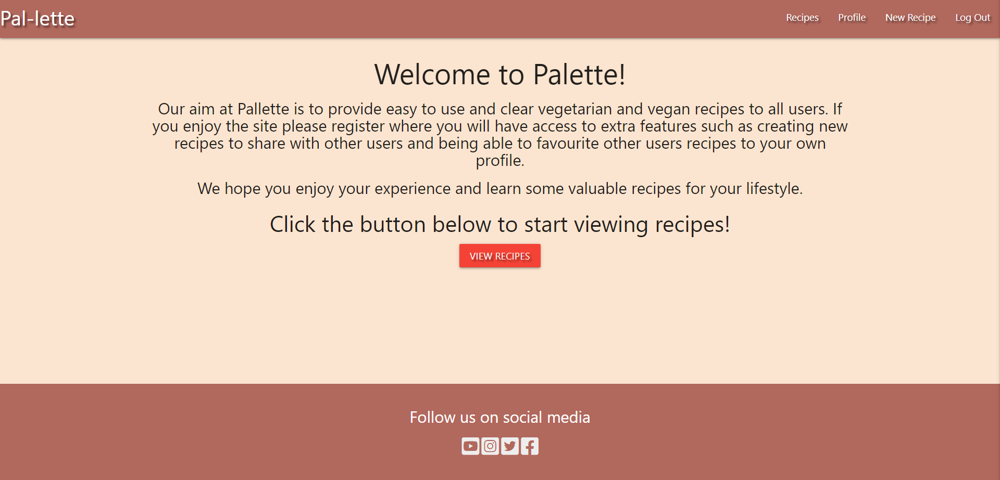
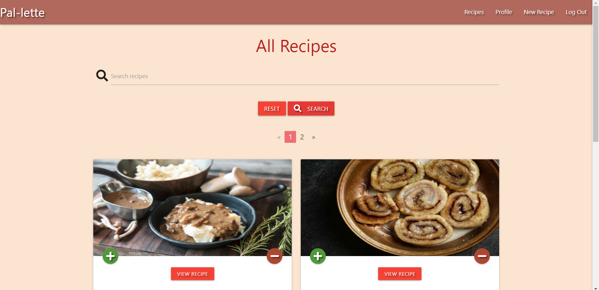
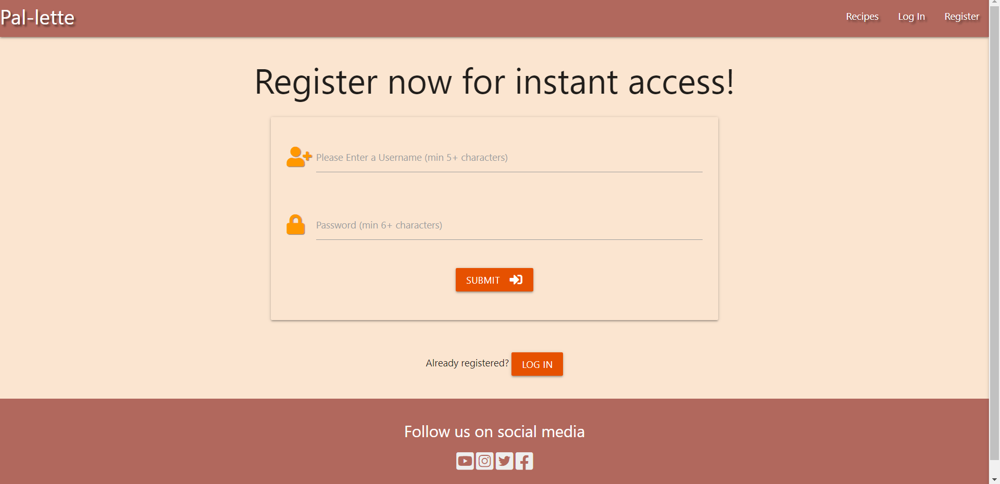
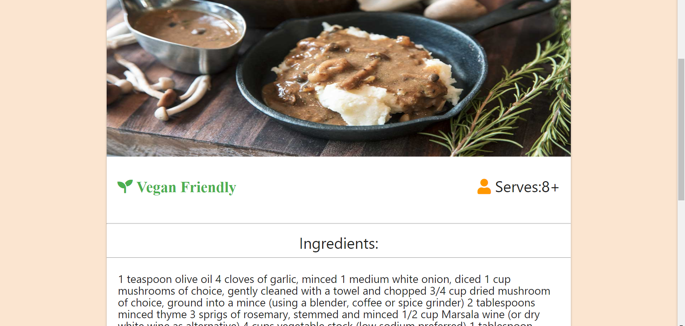
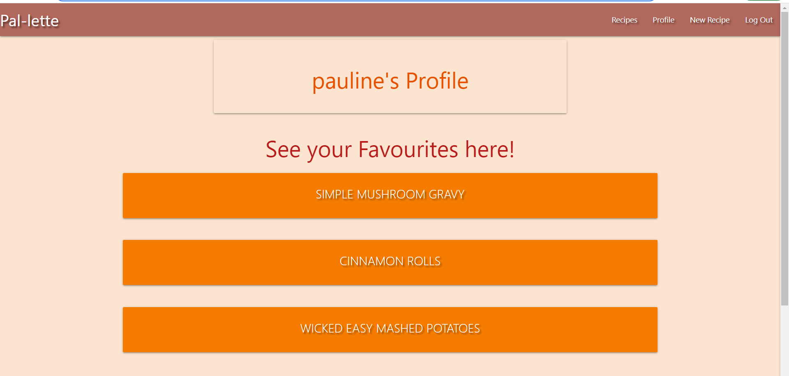
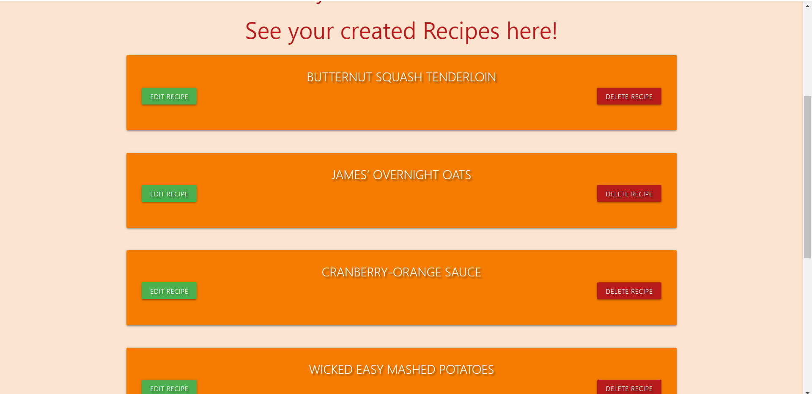
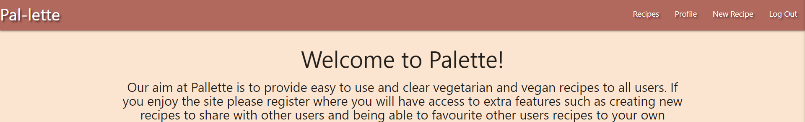
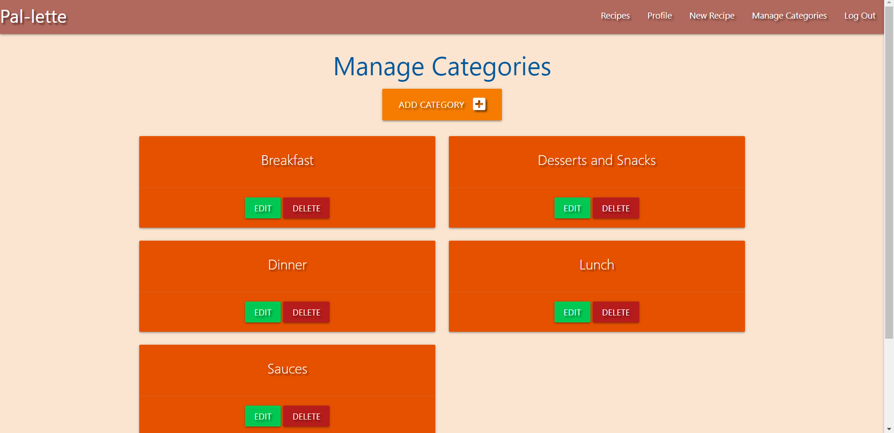

# Testing 

## Navbar Functionality 

- **Aim** - When the **Pallette** icon on the left of navbar is clicked it redirects user to homepage.
- **Result** - This was done and user is redirected therefore passing the test.
- **Aim** - When links to other pages are clicked, the user is redirected to the mentioned page.
- **Result** - Navbar link clicked and redirected to corresponding page therefore passing the test.
- **Aim** - When screen size is reduced the **hamburger** icon displays and when clicked redirects user to corresponding page.
- **Result** - Screen size reduced activates **hamburger** icon and when clicked it reveals the page navigation which when clicked redirects user to corresponding page 
therefore passing the test.
- **Aim** - To see whether nagivation bar stays on the top of the screen on both all screen sizes.
- **Result** - Screen size was reduced and navigation bar sticks to top of page on all sizes therefore passing the test.
- **Aim** - When the user is not logged in only the recipes, log in and register links show on navbar.
- **Result** - Visited site as a new user and only mentioned links appear therefore passing the test.
- **Aim** - When the user is logged in only the recipes, profile, new recipe and logout links show on navbar.
- **Result** - Visited site as a logged in user and only mentioned links appear therefore passing the test.
- **Aim** - When the user the site admin the recipes, profile, new recipe and logout links show on navbar with the addition of the manage categories link.
- **Result** - Visited site as the admin all mentioned links appear therefore passing the test.

## Footer Functionality

- **Aim** - **Social links** are contained in the footer and should redirect user to social media pages in a new tab.
- **Result** - Links were clicked and they open in a new tab to corresponding social media websites therefore passing the test.
- **Aim** - **Footer** should be always at the bottom of page.
- **Result** - Content from pages was removed and added again to see if the footer changed position and it remained on the bottom of page therefore passing the test.

## Button/Link Functionality

### Buttons 

- **Aim** - When the **register** button is clicked it displays a flash alerting the user it was either succesful or unsuccessful.
- **Result** - Button is clicked and message appears and redirects to correct page therefore passing the test.
- **Aim** - When **form fields** within both the log in and register forms are not filled correctly they do not submit.
- **Result** - When all fields are filled out the Log in and register buttons work when clicked but when even one isnt the required information prompt displays therefore passing the test.
- **Aim** - When **registration form** submit is clicked it should only work when required fields or username and password is in valid format.
- **Result** - Button clicked and doesnt submit until required info and valid username and password format is entered therefore passing the test.
- **Aim** - When **add to favourites** plus button is clicked it should add the recipe to the users favourite section on their profile page, and the same for the minus symbol it should remove the recipe from the profile.
- **Result** - Buttons clicked the recipe is added and removed as required and a pflash message appears informing the user whether it is already in the recipe or not..
- **Aim** - When **Create recipe** button is clicked it should only submit it once all fields have been filled and the same for the edit recipe page.
- **Result** - Button clicked and only edits or uploads the recipe once all fields are complete therefore passing the test.
- **Aim** - When the **Delete** button is clicked to delete a recipe it should remove the recipe from the site and database after a user prompt to ensure they want to delete it.
- **Result** - Buttons clicked and recipe deletes after the user clicks yes to the prompt therefore passing the test.
- **Aim** - When **Admin** is in their account the create,edit aand delete buttons should be only accesbile to them for manage categories.
- **Result** - Buttons only visible to admin and when clicked they perform their actions as expected therefore passing the test.

### Links

- **Aim** - When **social media** icon links are clicked it should redirect user to relevant social pages in a new tab.
- **Result** - Links were clicked and user redirected to relevant **social sites** in a new tab therefore passing the test.

## JavaScript Validator

- **[JSHint](https://jshint.com/)** - To Validate JavaScript and Jquery(Please copy and paste selected file into JSHint to reproduce results).

- **script.js** File = **Passed**- No errors found. One undefined variable $ (Warnings are ES6 related)

## Python PEP8 Validator

- **[PEP8online](http://pep8online.com/)** - To Validate Python code and ensure it is PEP8 complient(Please copy and paste selected file into PEP8online to reproduce results).

- **app.py** File = **Passed**- No errors found.

## CSS3 Validator 

- **[jigsawW3C](https://jigsaw.w3.org/css-validator/#validate_by_input)** - To Validate CSS.

- **style.css** = **Passed** with no errors found.

    

## HTML5 Validator

- **[validatorW3C](https://validator.w3.org/#validate_by_input)** - To Validate HTML5.

- **Base template page** = **Passed**- No errors found except for Jinja templating.[Results](https://validator.w3.org/nu/#textarea)
- **Add category page** = **Passed**- No errors found except for Jinja templating.[Results](https://validator.w3.org/nu/#textarea)
- **Add recipe page** = **Passed**- No errors found except for Jinja templating.[Results](https://validator.w3.org/nu/#textarea)
- **Manage categories Page** = **Passed**- No errors found except for Jinja templating.[Results](https://validator.w3.org/nu/#textarea)
- **Edit category page** = **Passed**- No errors found except for Jinja templating.[Results](https://validator.w3.org/nu/#textarea)
- **Edit recipe page** = **Passed**- No errors found except for Jinja templating and also duplicate id due to the fact it contains html which will only render if the user is an admin and this form uses the same id but only one can be in use at one time.The checkbox also raises an error but it was taken from materialize css page and functions as a switch.[Results](https://validator.w3.org/nu/#textarea)
- **Homepage page** = **Passed**- No errors found except for Jinja templating.[Results](https://validator.w3.org/nu/#textarea)
- **Log in page** = **Passed**- No errors found except for Jinja templating.[Results](https://validator.w3.org/nu/#textarea)
- **Profile page** = **Passed**- No errors found except for Jinja templating.[Results](https://validator.w3.org/nu/#textarea)
- **Recipes page** = **Passed**- No errors found except for Jinja templating.[Results](https://validator.w3.org/nu/#textarea)
- **Recipe page** = **Passed**- No errors found except for Jinja templating.[Results](https://validator.w3.org/nu/#textarea)
- **Register page** = **Passed**- No errors found except for Jinja templating.[Results](https://validator.w3.org/nu/#textarea)

## Compatibility

| Screen              | Google Chrome    | Safari           | Microsoft Edge   | Opera            | Mozilla Firefox  | Internet Explorer |
| --------------------|:----------------:|:----------------:|:----------------:|:----------------:|:----------------:|:-----------------:|
| Mobile              |     Passed:heavy_check_mark:|     Passed:heavy_check_mark:|     Passed:heavy_check_mark:|     Passed:heavy_check_mark:|     Passed:heavy_check_mark:| N/A               |
| Tablet              |     Passed:heavy_check_mark:|     Passed:heavy_check_mark:|     Passed:heavy_check_mark:|     Passed:heavy_check_mark:|     Passed:heavy_check_mark:| N/A               |
| Desktop             |     Passed:heavy_check_mark:|     Passed:heavy_check_mark:|     Passed:heavy_check_mark:|     Passed:heavy_check_mark:|     Passed:heavy_check_mark:| N/A               |

- The devices used for iOS testing were Macbook Pro, iPad mini, iPhone 10 and iPhone 8.
- The devices used for android testing were Huawei P30, Samsung A40, Samsung S20 aswell as Samsung Galaxy tab A7.
- For Windows 10 testing a HP pavillion was used as well as a HP Chromebook.
- Chrome Dev Tools was used for the other testing and every phone/tablet type and screen size was checked form the smallest available (320px),
to the largest (1200px +)

## Performance 

Testing for performance was done using [WebPageTest](https://www.webpagetest.org/).

- **Home page** = 100/100 on all except: Use gzip compression for transferring compressable responses 98/100 [View Results](https://www.webpagetest.org/result/210617_AiDc0K_8408cb663fa197e7c3a18bcafd16f1f2/1/performance_optimization/)
- **Recipes Page** = 100/100 on all except:Compress Images and Use gzip compression for transferring compressable responses 98/100 [View Results](https://www.webpagetest.org/result/210617_AiDcHE_a465ececcc97e31ab3f2d2fc3836b955/1/performance_optimization/)
- **Recipe Page** = 100/100 on all except:Compress Images and Use gzip compression for transferring compressable responses 96/100 [View Results](https://www.webpagetest.org/result/210617_BiDcBK_db05ced9ff53a16d385403369719a9bd/1/performance_optimization/)
- **Add Recipe Page** = 100/100 on all except:Compress Images and Use gzip compression for transferring compressable responses 94/100 [View Results](https://www.webpagetest.org/result/210617_AiDcZK_f5c2de5521ea5e04c815741f23ccf1df/1/performance_optimization/)
- **Log in page** = 100/100 on all except: Use gzip compression for transferring compressable responses 97/100 [View Results](https://www.webpagetest.org/result/210617_BiDc3H_51ac3ada5e535e8f1ccf7d47821e6880/1/performance_optimization/)
- **Register page** = 100/100 on all except: Use gzip compression for transferring compressable responses 97/100 [View Results](https://www.webpagetest.org/result/210617_AiDcS4_994f3d33c7de0004d923561fe11d53b4/1/performance_optimization/)

All other pages could not be tested for performance as special permissions were required to view them such as being an admin for manage categories page or logging in to a profile to view the profile page. I intend to work on the features mentioned in future and test the rest of the pages for performance once I find a workaround. I am pretty happy with the results from the performance testing though I would like to acheive 100 percent in all categories in future.

## User Stories Testing

1. As a new user I want to know the sites purpose immediately.
  - The Home page has a greeting explaining the purpose of the site, the name also suggests either something food or color related which was the intended purpose for a play on words with Pallette.
  - The view recipes button is available at the bottom which would further show the user the site is food related.
  

2. As a new user I want an intuitive search experience.
  - Upon landing on the home page the user will see the first navigation option which is the view recipes button.
  - Navigation is done mainly by way of the pagination links on the recipes page, this page also contains a search bar to search for words the recipes may contain such as butter etc.
 

3. As a new user I expect to be able to navigate the site easily to find a recipe.
  - The navbar also contains links to each page that is accessible depending on the users profile such as admin, logged in user or just a visitor to the site.
 

4. As a new user I expect to be able to sign up to services.
 - The register page contains a very simple form which can be expanded on in future but for now allows the user to quickly create a secure username and password for later log in.
 

5. As a potential customer I want an easy sign up process.
 - The register page contains a very simple form which can be expanded on in future but for now allows the user to quickly create a secure username and password for later log in.
 

6. As a potential customer I want an easily explained process for the recipes.
 - The recipe page contains useful information on the actual recipe selected and some info such as vegaan or not.
 

7. As a potential customer I want to have a good choice as well as favourite recipes.
 - When the user logs in this gives them access to create their own recipe via the create recipe page but also allows them to favourite their favourite recipes for later.
 

8. As a returning user I want information and other useful content to entice me to return.
 - The ability to add a recipe and favourite recipes I feel is a good feature that coupled with the fact it is a specific diet type will encourage those who choose this lifestyle to return for ease of use.
 

9. As a returning user I want to be able to create, read, update and delete my own recipes.
- Full CRUD funtioanlity is present for logged in users to use on their own recipes and the admin can alter any information on the site created by other users.
 

10. As a returning user I want to be able to have access to follow the company on social media.
- A footer is contained on each page which will open social media links on a new tab.
 

11. As a user I expect to be able to login and out of my own profile.
- Log in and out functionality is done by way of the navbar located on each page.
 

12. As a site admin I expect to be able to create, read, update and delete any information on the site.
- The admin can use CRUD functionality on any recipe with the additon of being able to mange the categories also.
 

## Usability  

- I shared the website with friends and family and received feedback from them stating the site was easy to use,
all features implemented fuctioned as expected.
They also mentioned that its simplicity lead to easy usage and navigation and the text and color choices made everything very user friendly.
Additional comments were that the page highlighted the recipes well and that the addition of the favourites buttons made it easy to see what recipes they were already interested in.

## Issues and Fixes during Development

1.Pagination was messing with the search functionality.
 - Attempted fixes = Non viable solutions tried were changing the pagination to work inside the get_recipes function and while it did work it didnt work as intended and still threw errors.
 - Solution = The problem ended up being that I was accessing the DB as a list in one instance and as a singular in another but both within the same function so I changed both to lists and it fixed the issue.
 - I also kept the Pagination fairly close to the original layout with some minor tweeks to help with readiblity and reduction of code used.
2.User able to brute force access pages using url only meant for admin.
 - Solution was to add condtions to the backend code to ensure only the admin could access those pages.

## Known Bugs

Favicon shows for all pages except the users profile page. Time did not allow for a solution to be found though it seems a trivial issue as the favicon does not affect the performance of the site.
